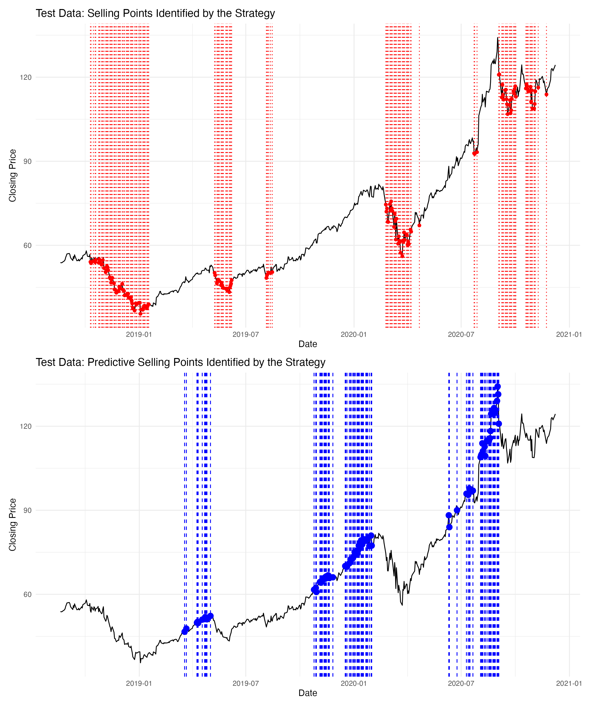

# Investment Strategy and Analysis Scripts

Investment strategy scripts for financial analysis, designed to for making informed investment decisions based on data and analysis from various sources.

## Pages and Resources

Here are the primary pages and resources used in this project:

### Investment instruments
- [ZKB Investment Instruments](https://www.zkb.ch/de/private/anlagen/anlageinstrumente.html)

### Fund products
- [ZKB All Products](https://zkb-finance.mdgms.com/products/stp/index.html?LANG=en#)

### Swisscanto investment funds
- [Swisscanto Funds](https://www.swisscanto.com/ch/de/swisscanto-fonds.html)
- [Swisscanto Index Funds](https://www.swisscanto.com/ch/de/swisscanto-fonds/indexfonds.html)
  - Discusses the advantages of Index funds over ETFs, such as the absence of Swiss stamp duty on purchases and sales.

## Product selection for investing

### Account Types
First, you will need a custody account for holding securities.
The following two are offered:
1. **Custody Account**: Suitable for holding a wide range of securities, including stocks, bonds, and ETFs. It enables trading and professional management of diverse investment instruments.
2. **Fund Portfolio Deposit**: Specifically tailored for mutual funds, this account offers a streamlined approach for managing these investments with potentially simpler administration and lower transaction fees.

## Purpose
The goal of this repository is to provide tools and insights that enable investors to navigate the financial markets more effectively. By consolidating various investment resources and analysis tools, we aim to create a comprehensive platform for investment strategy development.

## Examples
### SwissCanto funds analysis

### AAPL stock analysis
{width=45%}
{width=45%}
